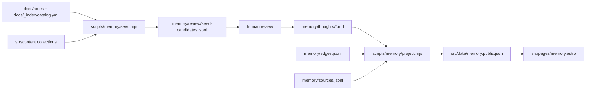

# Memory Second Brain Implementation Reference

Date: 2026-05-24
Status: Ready for implementation
Public reference for the checked-in memory projection workflow.

## Goal

Create a private-first second brain for Signal Notes and publish a safe
CareerHackerAlex-style `/memory` page from reviewed public thoughts.

The implementation has two layers:

1. `memory/**` is the durable source of truth for thoughts, edges, sources, and
   review candidates.
2. `src/data/memory.public.json` is the generated public projection consumed by
   the Astro route.

The public page must not import or parse private memory files directly.

## Runtime Shape



## File Responsibilities

`scripts/memory/schema.mjs`
: Owns schema constants, markdown frontmatter parsing, JSONL parsing, source
path safety, thought validation, edge validation, and projection eligibility
reasons.

`scripts/memory/seed.mjs`
: Reads deterministic repo metadata and writes private review candidates. It
does not publish anything.

`scripts/memory/project.mjs`
: Reads accepted thoughts and edges, validates sources, excludes private or
unreviewed items, and writes the public projection JSON.

`memory/thoughts/*.md`
: Human-readable atomic thoughts. These are the only durable thought source of
truth.

`memory/edges.jsonl`
: Typed thought-to-thought relationships.

`memory/sources.jsonl`
: Optional source metadata used to enrich projection output.

`memory/review/seed-candidates.jsonl`
: Generated intake queue for human review.

`src/data/memory.public.json`
: Generated static data for the public page. This file contains no private
thoughts.

`src/lib/memoryData.ts`
: Astro-facing data shape and missing-file fallback.

`src/pages/memory.astro`
: Public dual-surface UI with Map, Library, and Sources views.

## Thought File Contract

Each public thought must include:

```yaml
schema_version: 1
slug: context-quality-is-routing-problem
claim_ko: "컨텍스트 품질은 프롬프트 문장력이 아니라 라우팅과 검증 구조의 문제다."
claim_en: "Context quality is a routing and verification problem, not just prompt wording."
memory_type: semantic
origin: kws
confidentiality: public
surfaces: [memory-public, article-ready]
topics: [ai-workflow, context-engineering]
theses: [ai-workflow-quality]
sources:
  - kind: article
    path: src/content/articles/context-refinement-system-design.mdx
    title: "Context Refinement System 설계 요약"
    date: 2026-05-16
review:
  status: accepted
  reviewed_at: 2026-05-24
```

New thoughts should default to:

```yaml
confidentiality: private
surfaces: []
review:
  status: candidate
```

## Public Export Gate

A thought is exported only when all checks pass:

- `schema_version` is `1`.
- `confidentiality` is `public`.
- `surfaces` includes `memory-public`.
- `review.status` is `accepted`.
- `sources` contains at least one source.
- Local source paths are safe relative paths and resolve inside the repo.
- External source URLs use `http` or `https`.

The projection script logs excluded counts by reason:

- `private`
- `notAccepted`
- `notPublicSurface`
- `missingSource`
- `invalidSource`
- `unsupportedSchema`

## Seed Workflow

Run:

```bash
npm run memory:seed
```

Example output:

```text
Wrote <number> memory seed candidates to <repo>/memory/review/seed-candidates.jsonl
```

The seed file is review input, not public data. Promotion means manually moving
selected candidate records into `memory/thoughts/*.md`, adding reviewed
frontmatter, and setting public fields only when the thought is safe to publish.

## Projection Workflow

Run:

```bash
npm run memory:project
```

Expected output:

```text
Memory projection valid. thoughts=<number> topics=<number> edges=<number> sources=<number> excluded={...}
```

The command writes `src/data/memory.public.json`.

Validation-only mode:

```bash
npm run memory:validate
```

This must validate the same inputs without rewriting the public JSON.

## Public Page Behavior

`/memory` renders from `src/data/memory.public.json`.

The page contains:

- a public second-brain hero,
- counts for thoughts, topics, edges, and sources,
- `Map`, `Library`, and `Sources` tabs,
- deterministic positioned topic and thought nodes,
- a selected thought detail panel,
- topic-grouped thought cards,
- source cards linking back to published content when possible.

If no public data exists, the page renders an empty state that tells the owner
to run `npm run memory:project`.

## Testing Strategy

Test files:

- `scripts/memory.schema.test.mjs`
- `scripts/memory.seed.test.mjs`
- `scripts/memory.project.test.mjs`
- `src/lib/memoryData.test.mjs`

Required test evidence:

```bash
npm test -- scripts/memory.schema.test.mjs
npm test -- scripts/memory.seed.test.mjs
npm test -- scripts/memory.project.test.mjs
npm test -- src/lib/memoryData.test.mjs
npm run test
npm run build
npm run validate
```

After code changes:

```bash
graphify update .
```

## Execution Order

1. Implement schema validation test-first.
2. Implement seed candidate generation test-first.
3. Implement public projection test-first.
4. Add curated seed thoughts and generate public JSON.
5. Implement memory data loader.
6. Build `/memory` route and styles.
7. Add navigation.
8. Run full verification and Graphify refresh.

Each implementation task should commit only files listed in the execution plan.
Do not stage unrelated dirty worktree files.
