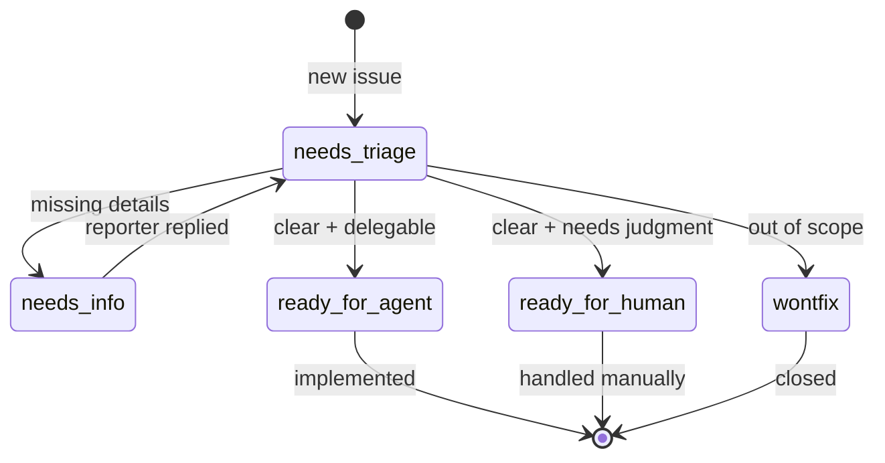

# mattpocock/skills 레포 분석

분석 대상: <https://github.com/mattpocock/skills>
분석 기준일: 2026-04-29
기준 커밋: `b56795bed1236302f42f61449210bf50cdbb8859`
라이선스: MIT
요약: AI 코딩 에이전트가 "빠르게 코드를 쓰는 도구"에 머무르지 않고, 요구사항 정렬, 도메인 언어 정리, 피드백 루프, 테스트, 이슈 관리, 아키텍처 개선까지 엔지니어링 루프 안에서 움직이도록 만드는 스킬 모음.

## 한 줄 결론

이 레포는 프롬프트 모음이 아니라, AI 에이전트에게 좋은 소프트웨어 엔지니어링 습관을 강제하는 작고 조합 가능한 작업 프로토콜 모음이다.

작성자의 핵심 메시지는 명확하다.

- AI 코딩의 실패 원인은 모델 성능만이 아니다.
- 요구사항 정렬, 도메인 언어, 재현 가능한 피드백 루프, 테스트, 모듈 설계가 무너지면 어떤 에이전트도 나쁜 결과를 낸다.
- 따라서 에이전트에게 "무엇을 만들라"고만 하지 말고, "어떤 절차를 따라 사고하고 검증해야 하는지"를 스킬로 주입해야 한다.

## 전체 구조

레포의 주요 구성은 다음과 같다.

```text
.
├── .claude-plugin/
│   └── plugin.json
├── .out-of-scope/
│   └── question-limits.md
├── docs/
│   └── adr/
│       └── 0001-explicit-setup-pointer-only-for-hard-dependencies.md
├── scripts/
│   └── link-skills.sh
├── skills/
│   ├── engineering/
│   ├── productivity/
│   ├── misc/
│   ├── personal/
│   └── deprecated/
├── CLAUDE.md
├── CONTEXT.md
├── LICENSE
└── README.md
```

## 버킷별 역할

| 영역 | 역할 | 대표 스킬 |
|---|---|---|
| `engineering/` | 실제 코드 작업의 핵심 루프 | `diagnose`, `tdd`, `grill-with-docs`, `triage`, `to-prd`, `to-issues`, `improve-codebase-architecture` |
| `productivity/` | 코드와 직접 연결되지 않은 작업 방식 | `grill-me`, `caveman`, `write-a-skill` |
| `misc/` | 유틸리티성 보조 스킬 | `git-guardrails-claude-code`, `setup-pre-commit`, `scaffold-exercises`, `migrate-to-shoehorn` |
| `personal/` | 작성자 개인 환경에 묶인 스킬 | `edit-article`, `obsidian-vault` |
| `deprecated/` | 더 이상 권장하지 않는 이전 스킬 | `qa`, `ubiquitous-language`, `request-refactor-plan`, `design-an-interface` |

이 분류는 꽤 좋은 편이다. 중요한 점은 "스킬을 기능별로만 나눈 것"이 아니라, 사용 빈도와 범용성에 따라 승격/격리한다는 점이다.

- 매일 쓰는 것은 `engineering/`, `productivity/`에 둔다.
- 환경 의존성이 강하거나 특수한 것은 `misc/`, `personal/`로 낮춘다.
- 버린 실험은 삭제하지 않고 `deprecated/`에 둔다.

이 방식은 학습에도 좋다. 무엇이 핵심이고 무엇이 주변인지 바로 보인다.

## 설치 및 노출 방식

### `.claude-plugin/plugin.json`

실제로 플러그인으로 노출되는 스킬 목록은 `.claude-plugin/plugin.json`에 있다.

등록된 스킬은 다음 12개다.

- `diagnose`
- `grill-with-docs`
- `triage`
- `improve-codebase-architecture`
- `setup-matt-pocock-skills`
- `tdd`
- `to-issues`
- `to-prd`
- `zoom-out`
- `caveman`
- `grill-me`
- `write-a-skill`

즉, `misc/`, `personal/`, `deprecated/`는 저장소에는 있지만 기본 플러그인 표면에는 없다.

작성자가 이렇게 한 이유는 타당하다. 에이전트에게 너무 많은 스킬을 노출하면 선택 비용이 늘고, 잘못된 스킬이 트리거될 가능성이 커진다. 핵심 스킬만 등록해 기본 경험을 작게 유지하려는 의도로 보인다.

### `scripts/link-skills.sh`

이 스크립트는 레포 안의 모든 `SKILL.md`를 찾아 `~/.claude/skills`에 심볼릭 링크한다.

장점:

- 로컬 Claude Code 환경에서 빠르게 실험하기 좋다.
- 플러그인 설치 흐름과 별개로 직접 연결할 수 있다.

단점:

- `find "$REPO/skills" -name SKILL.md` 방식이라 `deprecated/`, `personal/`까지 모두 링크될 수 있다.
- `.claude-plugin/plugin.json`이 의도적으로 좁힌 공개 표면과 다르게 동작한다.

개선한다면:

- 기본은 `engineering/`과 `productivity/`만 링크한다.
- `--include-misc`, `--include-personal`, `--include-deprecated` 같은 옵션을 둔다.
- 링크 전 어떤 스킬이 설치될지 목록을 보여주고 확인받는다.

예:

```bash
./scripts/link-skills.sh --default
./scripts/link-skills.sh --include-misc
./scripts/link-skills.sh --all
```

## 레포의 중심 철학

README는 네 가지 실패 모드를 중심으로 구성되어 있다.

### 1. 에이전트가 사용자가 원하는 것을 제대로 이해하지 못한다

해결책은 `grill-me`, `grill-with-docs`다.

작성자는 요구사항을 "처음부터 명확히 존재하는 것"으로 보지 않는다. 사용자가 말하면서 스스로 결정을 발견한다고 본다. 그래서 에이전트가 바로 구현하지 않고, 먼저 질문하고, 모호한 가지를 하나씩 닫게 만든다.

내 견해:

이 방향은 매우 좋다. AI 코딩에서 가장 비싼 실패는 "잘못 만든 것을 빠르게 많이 만드는 것"이다. 구현 속도를 올리기 전에 요구사항 정렬 비용을 일부러 지불하게 하는 스킬은 실전 가치가 높다.

다만 너무 질문이 길어지면 사용자는 피로해질 수 있다. 그래서 질문 모드에도 단계가 있으면 좋다.

- 빠른 모드: 핵심 질문 3개
- 표준 모드: 요구사항/제약/검증 질문 7-10개
- 깊은 모드: 도메인 모델, 엣지 케이스, ADR까지 정리

### 2. 에이전트가 프로젝트 언어를 몰라 장황해진다

해결책은 `CONTEXT.md`와 `grill-with-docs`다.

이 레포에서 가장 중요한 아이디어 중 하나는 도메인 언어를 별도 문서로 관리하는 것이다. 에이전트가 매번 코드에서 용어를 역추론하지 않고, 프로젝트 고유 개념을 바로 읽고 사용할 수 있게 한다.

예를 들어 "lesson이 파일 시스템에 실체화되는 과정" 같은 긴 설명을 프로젝트 고유 용어 하나로 줄일 수 있다. 이렇게 되면 대화, 코드 탐색, 테스트 이름, 이슈 제목이 모두 짧아진다.

내 견해:

이건 레포에서 가장 배울 만한 부분이다. AI 에이전트는 코드보다 "이 코드가 어떤 세계를 모델링하는지"를 모를 때 헛돈다. `CONTEXT.md`는 에이전트용 도메인 지도다.

보완한다면:

- `CONTEXT.md`에 "좋은 예 / 나쁜 예"를 더 많이 넣는다.
- 용어별 소유 모듈, 관련 테스트, 관련 ADR 링크를 선택적으로 붙인다.
- 오래된 용어를 감지하는 검증 스크립트를 둔다.

예:

```md
## Language

**Materialization**
Course section or lesson becomes backed by real filesystem artifacts.
Avoid: "make real", "create files for lesson"
Related: `src/materialization/*`, ADR-0004
```

### 3. 코드가 실제로 동작하는지 확인하지 않는다

해결책은 `diagnose`와 `tdd`다.

`diagnose`는 버그를 바로 고치려 하지 않는다. 먼저 재현 루프를 만들라고 한다.

이 순서가 핵심이다.

1. 피드백 루프 만들기
2. 재현하기
3. 가설 세우기
4. 계측하기
5. 수정하고 회귀 테스트 남기기
6. 정리하고 포스트모템 남기기

내 견해:

`diagnose`는 이 레포에서 가장 실전성이 높다. 특히 "재현 가능한 루프가 없으면 가설로 넘어가지 말라"는 규칙은 AI 에이전트에게 매우 중요하다. 에이전트는 코드만 보고 그럴듯한 원인을 말하는 경향이 있기 때문이다.

보완한다면:

- 버그 유형별 재현 루프 예시를 추가한다.
- UI 버그, API 버그, DB 버그, 비결정적 버그, 성능 회귀별 템플릿을 분리한다.
- 디버그 로그 prefix 생성/제거를 자동화하는 작은 스크립트를 넣는다.

### 4. AI가 빠르게 코드를 만들수록 구조가 빨리 망가진다

해결책은 `improve-codebase-architecture`다.

이 스킬은 "deep module" 사고를 중심으로 한다. 좋은 모듈은 작은 인터페이스 뒤에 많은 유용한 동작을 감춘다. 나쁜 모듈은 인터페이스가 구현만큼 복잡하거나, 단순 전달 계층에 가깝다.

작성자가 강조하는 개념:

- `Module`: 인터페이스와 구현을 가진 단위
- `Interface`: 타입 시그니처뿐 아니라 invariant, ordering, error mode, config 등 호출자가 알아야 하는 모든 것
- `Depth`: 작은 인터페이스가 큰 기능을 제공하는 정도
- `Seam`: 동작을 바꿀 수 있는 인터페이스 지점
- `Adapter`: seam을 만족하는 구체 구현
- `Locality`: 변경과 버그가 한 곳에 모이는 정도
- `Leverage`: 호출자가 얻는 효용

내 견해:

AI 코딩 시대에 이 주제는 더 중요해진다. 에이전트는 작은 유틸 함수와 얇은 래퍼를 많이 만들기 쉽다. 겉으로는 정리된 것처럼 보이지만 실제로는 개념이 흩어지고, 테스트도 내부 구현에 묶인다. 이 스킬은 그 위험을 잘 찌른다.

보완한다면:

- before/after 리팩터링 예시가 더 필요하다.
- "깊은 모듈 후보 점수표"를 두면 에이전트가 더 일관되게 후보를 고를 수 있다.
- 실제 PR 단위로 이어지는 `architecture-review -> refactor-plan -> tdd` 연결 흐름을 문서화하면 좋다.

예시 점수표:

| 기준 | 질문 |
|---|---|
| Interface complexity | 호출자가 알아야 할 것이 너무 많은가? |
| Locality | 변경하려면 여러 파일을 동시에 이해해야 하는가? |
| Testability | public interface만으로 중요한 동작을 검증할 수 있는가? |
| Duplication | 같은 정책/규칙이 여러 곳에 흩어져 있는가? |
| Domain fit | `CONTEXT.md`의 도메인 개념과 모듈 이름이 맞는가? |

## 핵심 스킬별 분석

### `setup-matt-pocock-skills`

역할:

레포별 기본 설정을 만든다.

- 이슈 트래커가 무엇인지
- triage label vocabulary가 무엇인지
- 도메인 문서가 어디에 있는지
- `AGENTS.md` 또는 `CLAUDE.md`의 `## Agent skills` 블록에 무엇을 기록할지
- `docs/agents/issue-tracker.md`, `triage-labels.md`, `domain.md`를 어떻게 만들지

작성자가 이렇게 만든 이유:

다른 스킬들이 GitHub Issues, local markdown, Linear 같은 작업 관리 위치를 제멋대로 추측하면 안 되기 때문이다. 특히 `to-issues`, `to-prd`, `triage`는 실제로 이슈를 만들거나 라벨을 붙인다. 이 설정이 틀리면 출력이 조금 흐린 정도가 아니라 실제 작업 관리가 망가진다.

좋은 점:

- "레포별 설정"과 "스킬 자체"를 분리했다.
- hard dependency와 soft dependency를 나누는 ADR이 있다.
- 기존 `CLAUDE.md`가 있으면 그것을 우선하고, 없을 때만 `AGENTS.md` 생성을 묻는다.

아쉬운 점:

- Codex, Cursor, Aider 등 다양한 에이전트 환경에 대한 중립적 문서 구조가 아직 약하다.
- 설정 결과를 검증하는 스크립트가 없다.

개선안:

- `docs/agents/config.schema.json` 같은 스키마를 둔다.
- `scripts/validate-agent-config.sh`를 만들어 `docs/agents/*`와 `CLAUDE.md` 블록의 일관성을 검사한다.
- Claude 전용 이름과 범용 이름을 분리한다.

예:

```text
docs/agents/
├── issue-tracker.md
├── triage-labels.md
├── domain.md
└── config.json
```

### `grill-me`

역할:

코드와 무관하게 계획이나 디자인을 집요하게 질문해 사용자의 생각을 명확하게 한다.

작성자가 이렇게 만든 이유:

AI가 구현 전에 모호성을 제거하도록 만들기 위해서다. 사용자가 "대충 이런 것"이라고 말했을 때 바로 만들면, 에이전트는 빈틈을 자기 마음대로 채운다.

좋은 점:

- 구현 전 정렬이라는 문제를 정면으로 다룬다.
- 사용자와 에이전트가 같은 결정 트리를 걷게 만든다.

아쉬운 점:

- 단독 파일은 매우 짧다. 실제 좋은 질문의 유형 예시가 부족하다.
- 초보 사용자는 "무슨 질문을 받아야 좋은지" 알기 어렵다.

개선안:

- 질문 카테고리 템플릿을 붙인다.

예:

```md
## Question categories

- Goal: what outcome matters?
- Users: who uses this?
- Constraints: what must not change?
- Edge cases: what breaks the naive version?
- Verification: how will we know it works?
- Scope: what is explicitly excluded?
```

### `grill-with-docs`

역할:

`grill-me`에 문서화를 결합한 버전이다. 사용자를 질문하면서 `CONTEXT.md`와 ADR을 갱신한다.

작성자가 이렇게 만든 이유:

대화에서 정리된 도메인 언어와 결정이 대화창 안에서 사라지지 않게 하기 위해서다. AI 에이전트의 가장 큰 약점 중 하나는 세션이 바뀌면 결정 맥락이 사라진다는 점이다. 문서화는 그 약점을 줄인다.

좋은 점:

- 질문과 문서화를 분리하지 않는다. 결정이 생기는 즉시 기록한다.
- ADR 생성 조건이 엄격하다. 되돌리기 어렵고, 맥락 없이는 놀랍고, 실제 trade-off가 있을 때만 제안한다.
- 구현 세부가 아니라 도메인 전문가에게 의미 있는 용어만 `CONTEXT.md`에 넣으라고 한다.

아쉬운 점:

- 실제 `CONTEXT.md`가 커졌을 때 정리/분할 전략이 더 필요하다.
- multi-context repo의 예시는 있지만 운영 규칙은 더 보강할 수 있다.

개선안:

- `CONTEXT.md` 유지보수 루틴을 추가한다.
- 용어 충돌 감지 절차를 추가한다.
- ADR index 파일을 자동 생성하거나 권장한다.

### `diagnose`

역할:

버그와 성능 회귀를 다루는 디버깅 절차다.

핵심 규칙:

- 먼저 재현 루프를 만든다.
- 재현하지 못하면 고치지 않는다.
- 가설은 3-5개 세운다.
- 계측은 가설 하나에 연결되어야 한다.
- 디버그 로그는 prefix를 붙이고 마지막에 제거한다.
- 수정 후 원래 재현 루프와 회귀 테스트를 모두 확인한다.

작성자가 이렇게 만든 이유:

AI 에이전트는 버그를 보면 바로 코드를 고치려는 경향이 있다. 하지만 재현 루프 없이 고친 코드는 우연히 맞았는지 알 수 없다. 작성자는 "피드백 루프가 속도 제한"이라는 관점으로 디버깅을 재구성한다.

좋은 점:

- 실전 디버깅 규율이 잘 들어 있다.
- 비결정적 버그에 대해 "재현율을 높이라"는 조언이 좋다.
- HITL bash script를 마지막 수단으로 둔 것도 현실적이다.

아쉬운 점:

- 언어/프레임워크별 재현 루프 예시가 부족하다.
- 성능 회귀 쪽은 방향만 있고 구체적 도구 연결은 약하다.

개선안:

- `recipes/` 폴더를 추가한다.

```text
diagnose/
├── SKILL.md
├── recipes/
│   ├── react-ui-bug.md
│   ├── api-regression.md
│   ├── db-query-slow.md
│   ├── flaky-test.md
│   └── cli-output-regression.md
└── scripts/
    └── hitl-loop.template.sh
```

### `tdd`

역할:

red-green-refactor 루프를 에이전트에게 강제한다.

핵심:

- 테스트는 public interface를 통해 observable behavior를 검증해야 한다.
- 내부 구현, private method, 내부 collaborator mock에 묶이면 나쁜 테스트다.
- 모든 테스트를 먼저 쓰고 모든 구현을 나중에 하는 horizontal slice를 금지한다.
- 하나의 행동 테스트와 하나의 최소 구현을 반복하는 vertical slice를 권장한다.

작성자가 이렇게 만든 이유:

에이전트가 대량으로 테스트를 먼저 만들면, 실제 구현에서 배운 사실이 반영되지 않은 "상상 속 테스트"가 생긴다. 그런 테스트는 리팩터링에 약하거나, 실제 버그를 못 잡는다.

좋은 점:

- 테스트 품질에 대한 관점이 명확하다.
- public behavior 중심이라 리팩터링 친화적이다.
- deep module과 testability를 연결한다.

아쉬운 점:

- "사용자 승인 후 진행"이 강해서 자동화된 작업 세션에서는 흐름이 끊길 수 있다.
- legacy code에서 첫 테스트 seam을 찾는 방법이 더 필요하다.

개선안:

- "legacy code에서 characterization test부터 시작하는 루트"를 추가한다.
- "approval이 필요한 모드"와 "AFK 모드"를 나눈다.

예:

```md
## Modes

- HITL mode: ask user before interface/test-scope decisions.
- AFK mode: infer from issue acceptance criteria, document assumptions, proceed one vertical slice at a time.
```

### `to-prd`

역할:

현재 대화와 코드베이스 이해를 바탕으로 PRD를 만들고 이슈 트래커에 등록한다.

특징:

- 새 인터뷰를 하지 않는다.
- 이미 대화에서 나온 내용을 종합한다.
- 구현할 주요 모듈과 테스트할 모듈을 사용자에게 확인한다.
- PRD에는 파일 경로나 코드 조각을 넣지 말라고 한다.

작성자가 이렇게 만든 이유:

PRD가 코드 파일 경로에 과도하게 묶이면 금방 낡는다. 반대로 사용자 관점 문제, 솔루션, user story, 구현/테스트 결정은 오래 남는다.

좋은 점:

- PRD를 conversation artifact로 만든다.
- 구현 세부와 제품 요구를 분리하려 한다.

아쉬운 점:

- "매우 긴 user stories"를 요구하는 부분은 과할 수 있다.
- 작은 기능에는 무거운 산출물이 될 수 있다.

개선안:

- PRD 크기 모드를 둔다.

```md
- Tiny PRD: bugfix or small improvement
- Standard PRD: feature-level work
- Epic PRD: cross-module/product work
```

### `to-issues`

역할:

계획이나 PRD를 독립적으로 집을 수 있는 이슈들로 쪼갠다.

핵심:

- horizontal layer가 아니라 vertical slice로 나눈다.
- 각 이슈는 좁지만 end-to-end로 검증 가능해야 한다.
- HITL과 AFK를 구분한다.
- blocker 관계를 정리한다.

작성자가 이렇게 만든 이유:

AI 에이전트에게 줄 좋은 작업 단위는 "DB 스키마 만들기", "API 만들기", "UI 만들기" 같은 수평 레이어가 아니다. 그런 방식은 중간 산출물이 실제 사용자 가치로 검증되지 않는다. 대신 작더라도 전체 경로를 통과하는 tracer bullet이 좋다.

좋은 점:

- AFK agent에게 넘길 수 있는 단위로 작업을 자른다.
- dependency order를 고려한다.
- parent issue를 닫지 말라는 규칙도 안전하다.

아쉬운 점:

- 좋은 vertical slice와 나쁜 vertical slice 예시가 더 필요하다.
- 이슈 크기 추정 기준이 없다.

개선안:

- slice 품질 체크리스트를 추가한다.

```md
## Slice quality checklist

- Can this be demoed alone?
- Does it cross the necessary layers?
- Does it avoid hidden dependency on unbuilt slices?
- Can an AFK agent verify completion without asking the user?
- Is the acceptance criteria observable?
```

### `triage`

역할:

이슈를 작은 상태 머신으로 관리한다.

카테고리:

- `bug`
- `enhancement`

상태:

- `needs-triage`
- `needs-info`
- `ready-for-agent`
- `ready-for-human`
- `wontfix`

작성자가 이렇게 만든 이유:

이슈 트래커는 금방 혼란스러워진다. 특히 AI 에이전트가 이슈를 만들고 처리하기 시작하면 "이게 준비된 작업인지", "사람 판단이 필요한지", "정보가 부족한지"를 명확히 해야 한다.

좋은 점:

- 상태가 작고 명확하다.
- `ready-for-agent`와 `ready-for-human`을 구분한 점이 좋다.
- AI가 남기는 triage comment에 disclaimer를 붙이는 규칙이 있다.
- `.out-of-scope/` 지식베이스를 둬서 반복되는 wontfix 요청을 기억한다.

아쉬운 점:

- 실제 GitHub/Linear/Jira별 구현 차이가 더 명시되면 좋다.
- 상태 전이 다이어그램이 있으면 이해가 쉽다.

개선안:



### `improve-codebase-architecture`

역할:

코드베이스에서 shallow module을 찾아 deep module로 바꿀 기회를 찾는다.

작성자가 이렇게 만든 이유:

AI 에이전트는 속도가 빠르기 때문에 나쁜 구조도 빠르게 증식시킨다. 이 스킬은 개발 속도보다 구조적 품질을 주기적으로 점검하게 한다.

좋은 점:

- 용어를 엄격히 제한한다. `component`, `service`, `boundary` 같은 범용어로 흐르지 말고 `Module`, `Interface`, `Seam`, `Adapter` 같은 단어를 쓰라고 한다.
- deletion test가 실용적이다.
- 테스트 가능성과 아키텍처를 분리하지 않는다.

아쉬운 점:

- 실제 코드 예시가 적다.
- 후보를 찾은 뒤 PR로 이어지는 실행 계획은 별도 스킬과 연결해야 한다.

개선안:

- `architecture-candidate.md` 템플릿을 추가한다.

```md
## Candidate

### Files

### Current interface

### Hidden complexity

### Proposed deeper interface

### Tests after refactor

### Risks

### Migration plan
```

### `zoom-out`

역할:

코드 일부를 더 큰 시스템 맥락에서 설명하게 하는 매우 짧은 스킬이다.

작성자가 이렇게 만든 이유:

에이전트와 사용자는 특정 파일이나 함수에 매몰되기 쉽다. 이때 "시스템 전체에서 이게 어떤 역할인지" 설명하게 하는 안전장치다.

좋은 점:

- 짧고 목적이 선명하다.
- 복잡한 레포 탐색 전에 쓰기 좋다.

아쉬운 점:

- 너무 짧아서 구체 출력 형식이 없다.

개선안:

출력 템플릿을 추가하면 좋다.

```md
## Zoom-out response format

- System role
- Upstream callers
- Downstream dependencies
- Domain concepts involved
- Tests that protect it
- Risks when changing it
```

### `caveman`

역할:

응답을 극도로 짧게 만드는 커뮤니케이션 모드다.

작성자가 이렇게 만든 이유:

AI 에이전트는 장황해지기 쉽다. 특히 자주 쓰는 개발 루프에서는 토큰과 주의력이 낭비된다.

좋은 점:

- "짧지만 기술적 정확성은 유지"라는 방향이 분명하다.
- 보안 경고나 되돌릴 수 없는 작업에서는 자동으로 명확성 모드로 빠지는 예외가 있다.

아쉬운 점:

- 한국어 같은 언어에는 그대로 적용하기 어렵다.
- 팀 협업 문맥에서는 너무 거칠게 느껴질 수 있다.

개선안:

- 언어별 compression style을 분리한다.
- ` terse`, `normal`, `explain` 같은 응답 밀도 레벨을 둔다.

### `write-a-skill`

역할:

새로운 스킬을 만드는 방법을 안내한다.

핵심:

- `SKILL.md`는 짧게 유지한다.
- description이 trigger 판단의 핵심이다.
- deterministic 작업은 scripts로 분리한다.
- 100줄이 넘으면 reference 파일로 나눈다.

작성자가 이렇게 만든 이유:

스킬 자체도 관리 가능한 단위여야 한다. 거대한 프롬프트 하나보다 작은 스킬과 참조 파일이 낫다.

좋은 점:

- progressive disclosure 원칙이 있다.
- description의 중요성을 정확히 짚는다.

아쉬운 점:

- 스킬 검증 방법이 약하다.
- 좋은 스킬/나쁜 스킬 비교 예시가 더 많으면 좋다.

개선안:

- `skill-lint` 스크립트 추가
- description 길이, frontmatter, 링크 유효성 검사
- 테스트용 invocation example 추가

## `misc/` 스킬 분석

### `git-guardrails-claude-code`

위험한 git 명령을 Claude Code hook으로 막는 스킬이다.

막는 명령:

- `git push`
- `git reset --hard`
- `git clean -f`
- `git branch -D`
- `git checkout .`
- `git restore .`

좋은 점:

- AI 에이전트에게 destructive command 권한을 제한하려는 현실적인 장치다.
- project scope와 global scope를 묻는다.

아쉬운 점:

- Claude Code hook에 묶여 있다.
- 차단 정책이 팀별로 달라질 수 있는데 정책 파일 분리가 없다.

개선안:

- `dangerous-git-policy.json` 같은 정책 파일을 분리한다.
- Codex, Cursor 등 다른 환경의 guardrail 예시도 추가한다.

### `setup-pre-commit`

Husky, lint-staged, Prettier, typecheck, test를 pre-commit hook으로 설정한다.

좋은 점:

- AI가 만든 변경을 커밋 전에 최소한 검증하게 한다.
- package manager 감지 절차가 있다.

아쉬운 점:

- Node 프로젝트 중심이다.
- Python, Rust, Go 등에는 직접 적용하기 어렵다.

개선안:

- 언어별 pre-commit recipe를 나눈다.
- 기존 hook이 있을 때 merge 전략을 더 자세히 적는다.

## `deprecated/`를 남겨둔 이유

폐기된 스킬을 남겨둔 것은 좋은 선택이다. 이유는 세 가지다.

1. 이전 아이디어가 왜 폐기됐는지 추적할 수 있다.
2. 사용자가 여전히 필요한 경우 참고할 수 있다.
3. 작성자의 사고 변화가 보인다.

특히 `ubiquitous-language`가 deprecated되고 `grill-with-docs`와 `CONTEXT.md`로 흡수된 흐름이 흥미롭다. 별도 glossary 생성보다, 요구사항 대화 중 도메인 언어를 바로 문서화하는 쪽이 더 자연스럽다고 판단한 것으로 보인다.

개선한다면:

- 각 deprecated 스킬에 "대체 스킬"과 "폐기 이유"를 명시한다.

예:

```md
Deprecated: use `grill-with-docs` instead.
Reason: domain language should be updated inline during planning, not generated as a separate after-the-fact artifact.
```

## 작성자가 이렇게 구성한 이유

내가 보기에는 이 레포의 구조는 다음 원칙으로 설계되어 있다.

### 1. 작은 스킬을 조합한다

GSD, BMAD, Spec-Kit처럼 전체 프로세스를 크게 소유하는 방식과 달리, 이 레포는 작은 스킬을 조합한다.

장점:

- 필요한 것만 쓸 수 있다.
- 각 스킬을 수정하기 쉽다.
- 에이전트가 한 번에 읽을 문맥이 작다.

단점:

- 스킬 간 흐름을 사용자가 이해해야 한다.
- 초보자는 무엇부터 써야 할지 헷갈릴 수 있다.

### 2. 레포별 설정과 스킬을 분리한다

`setup-matt-pocock-skills`는 이슈 트래커, 라벨, 도메인 문서 위치를 레포별로 저장한다.

이건 좋은 설계다. 스킬이 모든 프로젝트에 같은 GitHub label을 가정하면 안 된다.

### 3. 대화 산출물을 문서로 남긴다

`CONTEXT.md`, ADR, `.out-of-scope/`, `docs/agents/`가 모두 같은 방향을 본다.

핵심은 "에이전트 세션 안에서 생긴 결정이 세션 밖에도 남아야 한다"는 것이다.

### 4. 에이전트의 충동을 막는다

이 스킬들은 에이전트에게 자주 제동을 건다.

- 구현 전에 질문하라.
- 재현 전에 수정하지 말라.
- 테스트는 하나씩 써라.
- 인터페이스가 얕으면 구조를 의심하라.
- 이슈는 상태 머신으로 관리하라.

즉, 생산성 향상보다 "잘못된 자동화 방지"에 더 가깝다.

## 강점

### 1. 실제 엔지니어링 습관에 기반한다

TDD, debugging loop, ADR, DDD-style language, deep module 같은 오래 검증된 사고를 AI 작업에 맞게 옮겼다.

### 2. 에이전트의 약점을 잘 안다

이 레포는 에이전트가 다음 행동을 잘못한다는 것을 전제로 한다.

- 요구사항을 추측한다.
- 코드를 읽다 맥락을 잃는다.
- 검증 없이 고친다.
- 테스트를 구현에 묶는다.
- 작은 래퍼를 많이 만든다.

스킬들은 이 약점을 절차로 보정한다.

### 3. 스킬 크기가 적당하다

핵심 `SKILL.md` 대부분이 70-120줄 정도다. 너무 짧지도 길지도 않다.

### 4. 문서화 위치가 좋다

`CONTEXT.md`, `docs/adr/`, `docs/agents/`로 역할을 나눈다.

- `CONTEXT.md`: 도메인 언어
- `docs/adr/`: 결정 기록
- `docs/agents/`: 에이전트 운영 설정

### 5. 작업 단위에 대한 감각이 좋다

`to-issues`의 vertical slice, HITL/AFK 구분은 AI 에이전트 시대에 매우 중요하다.

## 단점과 리스크

### 1. Claude 중심성이 강하다

`.claude-plugin`, `~/.claude/skills`, `CLAUDE.md`, Claude hook 등이 전제다.

Codex, Cursor, Gemini CLI, Aider 등에서도 쓸 수는 있지만, 이름과 설치 방식은 직접 맞춰야 한다.

개선:

- `AGENTS.md` 우선 범용 가이드를 추가한다.
- `adapters/claude`, `adapters/codex`, `adapters/cursor` 식으로 설치 문서를 나눈다.

### 2. 설치 경로와 공개 스킬 목록이 불일치한다

`plugin.json`은 핵심 12개만 노출한다. 하지만 `link-skills.sh`는 모든 `SKILL.md`를 링크한다.

개선:

- `plugin.json` 기준으로 링크하는 옵션을 기본값으로 둔다.
- `deprecated/`는 기본 링크 대상에서 제외한다.

### 3. 자동 검증이 부족하다

이 레포 자체는 Markdown과 Shell 중심이다. 하지만 다음을 검사하는 자동화가 있으면 좋다.

- 모든 공개 스킬이 README에 링크되어 있는가?
- 모든 공개 스킬이 `plugin.json`에 들어 있는가?
- `SKILL.md` frontmatter가 유효한가?
- dead link가 없는가?
- `disable-model-invocation` 같은 메타데이터가 의도대로 쓰였는가?

개선:

```text
scripts/
├── validate-skills.sh
├── validate-links.sh
└── validate-plugin-json.sh
```

### 4. 예시가 부족하다

스킬의 철학은 좋지만, 처음 배우는 사람에게는 실제 적용 예시가 더 필요하다.

개선:

```text
examples/
├── diagnose-api-bug/
├── tdd-small-feature/
├── grill-with-docs-session/
├── to-issues-breakdown/
└── architecture-review/
```

각 예시는 다음을 포함하면 좋다.

- 사용자 요청
- 에이전트가 읽은 스킬
- 중간 질문
- 생성된 문서
- 최종 코드/이슈/테스트 결과

### 5. 사용자 피로 관리가 약하다

`grill-*` 계열은 의도적으로 집요하다. 하지만 실제 작업에서는 질문이 너무 길어져 속도를 떨어뜨릴 수 있다.

개선:

- depth option 추가
- 질문 예산 추가
- 질문을 묶어서 하는 모드 추가
- "지금은 추정하고 진행, 나중에 검증" 모드 추가

예:

```md
## Interview depth

- `quick`: ask only blockers
- `standard`: ask enough to prevent obvious rework
- `deep`: walk the full decision tree and update docs
```

### 6. 보안/권한 모델이 더 필요하다

`git-guardrails`는 좋지만, AI 에이전트가 실제로 위험할 수 있는 영역은 git뿐만이 아니다.

추가하면 좋은 것:

- DB destructive operation guard
- cloud deploy guard
- production secret access guard
- issue tracker bulk edit guard
- package install guard

## 내가 개선한다면 만들 구조

나라면 이 레포를 다음처럼 보완하겠다.

```text
.
├── .claude-plugin/
│   └── plugin.json
├── adapters/
│   ├── claude/
│   ├── codex/
│   └── cursor/
├── docs/
│   ├── adr/
│   ├── concepts/
│   │   ├── context-md.md
│   │   ├── vertical-slices.md
│   │   ├── deep-modules.md
│   │   └── feedback-loops.md
│   └── learning-path.md
├── examples/
│   ├── diagnose/
│   ├── tdd/
│   ├── grill-with-docs/
│   └── to-issues/
├── scripts/
│   ├── link-skills.sh
│   ├── validate-skills.sh
│   └── validate-agent-config.sh
└── skills/
    ├── engineering/
    ├── productivity/
    ├── misc/
    ├── personal/
    └── deprecated/
```

### 추가하고 싶은 문서

#### `docs/learning-path.md`

초보자가 어떤 순서로 읽고 써야 하는지 안내한다.

추천 순서:

1. README
2. `setup-matt-pocock-skills`
3. `grill-with-docs`
4. `diagnose`
5. `tdd`
6. `to-prd`
7. `to-issues`
8. `triage`
9. `improve-codebase-architecture`

#### `docs/concepts/feedback-loops.md`

`diagnose`와 `tdd`를 관통하는 핵심 개념인 feedback loop를 설명한다.

#### `docs/concepts/domain-language.md`

`CONTEXT.md`를 어떻게 유지하고, 어떤 용어를 넣고, 어떤 용어를 빼야 하는지 설명한다.

#### `docs/concepts/agent-ready-issues.md`

`ready-for-agent` 이슈가 갖춰야 할 조건을 구체화한다.

### 추가하고 싶은 스킬

#### `review-agent-output`

AI 에이전트가 만든 변경을 검토하는 스킬.

핵심 질문:

- 요구사항과 다른 추정이 들어갔는가?
- 테스트가 behavior를 검증하는가?
- 불필요한 abstraction이 생겼는가?
- 에러 처리와 edge case가 누락됐는가?
- 기존 domain language와 이름이 맞는가?

#### `document-after-change`

변경 후 `CONTEXT.md`, ADR, README, issue 상태를 업데이트하는 스킬.

#### `agent-ready-check`

이슈가 AFK 에이전트에게 넘길 수 있는지 검사하는 스킬.

체크:

- acceptance criteria가 observable한가?
- scope가 명확한가?
- 필요한 코드 위치나 도메인 문서가 링크되어 있는가?
- 사람 판단이 필요한 항목이 남아 있는가?
- 테스트 방법이 명시되어 있는가?

#### `regression-test-hunt`

버그 수정 후 올바른 회귀 테스트 seam을 찾는 데 특화된 스킬.

## 이 레포를 내 프로젝트에 적용하는 법

### 1단계: 그대로 설치하지 말고 핵심만 읽기

먼저 다음 파일만 읽는다.

- `README.md`
- `skills/engineering/setup-matt-pocock-skills/SKILL.md`
- `skills/engineering/grill-with-docs/SKILL.md`
- `skills/engineering/diagnose/SKILL.md`
- `skills/engineering/tdd/SKILL.md`
- `skills/engineering/improve-codebase-architecture/SKILL.md`

### 2단계: 내 프로젝트용 `CONTEXT.md` 만들기

처음부터 완벽할 필요 없다.

```md
# Project Context

## Language

**User**
...

**Workspace**
...

**Document**
...

## Relationships

- A User owns many Workspaces
- A Workspace contains many Documents

## Flagged ambiguities

- "account" sometimes means User, sometimes Organization. Resolve before using.
```

### 3단계: 작은 기능 하나에 `grill-with-docs` 방식 적용

구현 전 질문:

- 이 기능의 실제 사용자는 누구인가?
- 성공을 어떻게 관찰할 수 있는가?
- 어떤 도메인 용어가 새로 생기는가?
- 기존 용어와 충돌하는가?
- 어떤 결정은 ADR로 남겨야 하는가?

### 4단계: 버그 하나에 `diagnose` 적용

고칠 버그를 하나 고르고, 먼저 재현 루프를 만든다.

- failing test
- curl script
- Playwright script
- CLI fixture
- captured log replay

재현 루프 없이 코드 수정하지 않는다.

### 5단계: 작은 기능 하나에 `tdd` 적용

한 번에 하나씩 한다.

1. behavior test 하나 작성
2. 실패 확인
3. 최소 구현
4. 성공 확인
5. 다음 behavior test
6. 마지막에 refactor

### 6단계: 작업을 `to-issues` 방식으로 쪼개기

기능을 layer별로 나누지 말고 vertical slice로 나눈다.

나쁜 예:

- DB schema 만들기
- API 만들기
- UI 만들기

좋은 예:

- 사용자가 하나의 draft document를 만들고 목록에서 볼 수 있다.
- 사용자가 draft document 제목을 수정할 수 있다.
- 사용자가 draft document를 archive할 수 있다.

각 이슈는 작지만 demo 가능해야 한다.

## 학습 체크리스트

이 레포를 제대로 이해했는지 확인하려면 다음 질문에 답할 수 있어야 한다.

- 왜 `setup-matt-pocock-skills`가 먼저 필요한가?
- hard dependency skill과 soft dependency skill의 차이는 무엇인가?
- `CONTEXT.md`에는 어떤 용어를 넣고 어떤 용어를 넣으면 안 되는가?
- 왜 `diagnose`는 재현 루프를 가장 중요하게 보는가?
- 왜 `tdd`는 horizontal test writing을 금지하는가?
- vertical slice와 horizontal slice의 차이는 무엇인가?
- `ready-for-agent`와 `ready-for-human`의 차이는 무엇인가?
- deep module과 shallow module의 차이는 무엇인가?
- deletion test는 무엇을 판단하기 위한 도구인가?
- ADR은 언제 만들고 언제 만들면 안 되는가?

## 개인적인 평가

이 레포의 가치는 "좋은 프롬프트 문장"보다 "좋은 작업 순서"에 있다.

특히 다음 세 가지는 바로 가져다 쓸 가치가 높다.

1. `diagnose`의 재현 루프 우선 원칙
2. `tdd`의 public behavior 중심 테스트 원칙
3. `grill-with-docs`의 도메인 언어 문서화 원칙

반대로 그대로 받아쓰기보다 조심할 부분도 있다.

1. Claude 중심 설치 구조
2. 질문 피로
3. 예시 부족
4. 자동 검증 부족
5. `link-skills.sh`와 `plugin.json`의 공개 범위 불일치

내가 이 레포를 학습한다면 먼저 스킬을 외우지 않을 것이다. 대신 각 스킬이 막으려는 실패 모드를 익히겠다.

- 요구사항 오해 -> `grill-*`
- 도메인 언어 혼란 -> `CONTEXT.md`
- 검증 없는 수정 -> `diagnose`
- 구현에 묶인 테스트 -> `tdd`
- 작업 단위 붕괴 -> `to-issues`
- 이슈 트래커 혼란 -> `triage`
- 구조 부채 증가 -> `improve-codebase-architecture`

이 관점으로 보면 이 레포는 "AI 코딩 스킬 모음"이 아니라 "AI 시대의 소프트웨어 엔지니어링 운영 매뉴얼"에 가깝다.

## 추천 학습 순서

### 1일차: 전체 구조 파악

- README 읽기
- `plugin.json` 보기
- `skills/engineering/README.md` 보기
- 각 스킬의 description만 읽기

목표: 어떤 상황에서 어떤 스킬이 쓰이는지 감 잡기.

### 2일차: 도메인 언어와 문서화

- `grill-with-docs`
- `CONTEXT-FORMAT.md`
- `ADR-FORMAT.md`
- 루트 `CONTEXT.md`
- `docs/adr/0001-*`

목표: AI 에이전트에게 프로젝트 언어를 먹이는 방법 이해.

### 3일차: 디버깅

- `diagnose`
- `hitl-loop.template.sh`

목표: 버그를 바로 고치지 않고 재현 루프부터 만드는 습관 익히기.

### 4일차: TDD

- `tdd`
- `tests.md`
- `mocking.md`
- `interface-design.md`
- `deep-modules.md`

목표: behavior 중심 테스트와 vertical loop 이해.

### 5일차: 이슈화

- `to-prd`
- `to-issues`
- `triage`
- `AGENT-BRIEF.md`
- `OUT-OF-SCOPE.md`

목표: 사람/에이전트가 처리 가능한 작업 단위 만들기.

### 6일차: 아키텍처

- `improve-codebase-architecture`
- `LANGUAGE.md`
- `DEEPENING.md`
- `INTERFACE-DESIGN.md`

목표: shallow module과 deep module을 구분하는 눈 만들기.

### 7일차: 내 버전 만들기

내 프로젝트에 맞는 최소 버전을 만든다.

```text
AGENTS.md 또는 CLAUDE.md
CONTEXT.md
docs/adr/
docs/agents/
```

그리고 다음 세 가지 규칙만 먼저 적용한다.

- 버그는 재현 루프 없이 고치지 않는다.
- 기능은 behavior test 하나씩 만든다.
- 모호한 용어는 `CONTEXT.md`에 정리한다.

## 최종 제안

이 레포를 배울 때 목표를 "mattpocock의 스킬을 그대로 쓰기"로 잡으면 절반만 배운 것이다. 더 좋은 목표는 "내 프로젝트에 맞는 AI 엔지니어링 루프를 설계하기"다.

가장 먼저 내 프로젝트에 도입할 최소 세트는 다음이다.

```text
1. CONTEXT.md
2. diagnose 방식의 재현 루프
3. tdd 방식의 vertical red-green-refactor
4. to-issues 방식의 vertical slice issue
5. triage 방식의 ready-for-agent 기준
```

이 다섯 개만 제대로 적용해도 AI 에이전트 작업 품질은 크게 좋아질 가능성이 높다.
